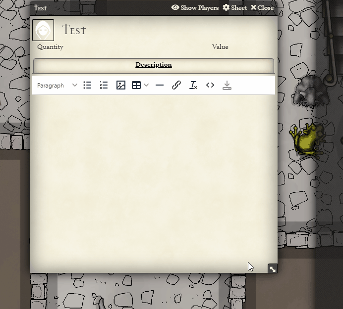

<!--- Downloads @ Latest Badge -->
<!--- replace <user>/<repo> with your username/repository -->
<!---  -->

<!--- Forge Bazaar Install % Badge -->
<!--- replace <your-module-name> with the `name` in your manifest -->
<!---  -->

# DEPRECATED AS OF 0.8.X

This module has been consumed into Core: gitlab.com/foundrynet/foundryvtt/-/issues/358

# TinyMCE Foundry File Picker

Enables the Foundry File Picker as an option when picking Images / Media / Links for all TinyMCE editors, allowing for easy in-world image inserting

## Changelog

